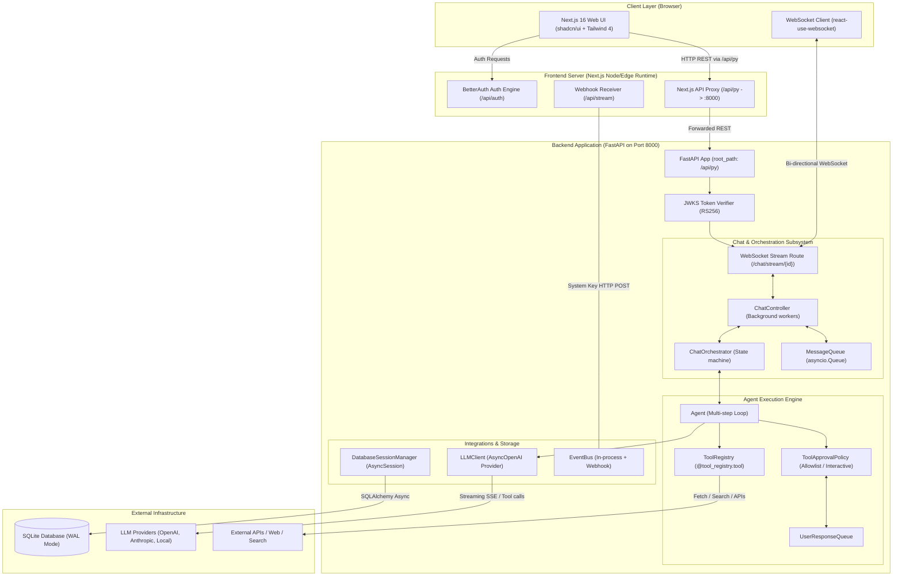

# Asterism Architecture Documentation

Welcome to the **Asterism** system architecture documentation. This directory provides in-depth, human-understandable explanations and visual diagrams of how Asterism operates under the hood.

Asterism is a full-stack, multi-agent AI application designed around **coordinated, capability-scoped agents** that collaborate to satisfy user intent.

---

## Architecture Document Index

| Document                                               | Description                                                      | Key Components & Focus                                                               |
| ------------------------------------------------------ | ---------------------------------------------------------------- | ------------------------------------------------------------------------------------ |
| [System Overview](overview.md)                         | High-level topology, monorepo design, request lifecycle          | Full-stack data flow, Next.js reverse proxy, FastAPI                                 |
| [Tool Authorization & Approval](tool-authorization.md) | Deep dive into tool security, policies, and interactive approval | `ToolApprovalPolicy`, `InteractiveApprovalPolicy`, WebSockets, Sub-agent permissions |
| [Agent Runtime & Execution Loop](agent-runtime.md)     | Agent lifecycle, LLM streaming, reasoning, multi-step loops      | `Agent`, `LLMClient`, `sub_agent`, prompt construction                               |
| [Chat & Real-Time WebSocket](chat-and-websocket.md)    | Real-time chat streaming, bidirectional messaging, queueing      | `ChatController`, `ChatOrchestrator`, `MessageQueue`                                 |
| [Data Model & Storage](data-and-storage.md)            | Relational schema, SQLite WAL, JSONB columns, message tree       | SQLAlchemy async, Pydantic type adapters, ER diagram                                 |
| [Authentication & Security](auth-and-security.md)      | Identity federation, token verification, internal hooks          | BetterAuth, PyJWKClient, RS256, system key                                           |

---

## High-Level System Topology

---

## Core System Principles

1. **Principle of Least Privilege**: Agents can only execute tools explicitly assigned in their profile and permitted by the current chat session.
2. **Explicit Human-in-the-Loop**: Dangerous or non-whitelisted tool calls require interactive, real-time approval through the WebSocket protocol before execution.
3. **Pluggable Architecture**: Storage, LLM providers, and approval policies are written behind explicit Python protocols and abstract interfaces.
4. **Resilient Local-First Design**: Optimized for single-tenant or enterprise self-hosting with high-concurrency SQLite (WAL mode, busy timeout, memory caching).

---

## Navigating the Codebase

- **Backend Entrypoint**: [`asterism.main:app`](../apps/backend/asterism/main.py)
- **Lifecycle & Initialization**: [`asterism.core.lifespan:lifespan`](../apps/backend/asterism/core/lifespan.py)
- **Agent Orchestration**: [`asterism.domains.agent.agent:Agent`](../apps/backend/asterism/domains/agent/agent.py)
- **Tool Authorization Policy**: [`asterism.domains.agent.approval:ToolApprovalPolicy`](../apps/backend/asterism/domains/agent/approval.py)
- **WebSocket Streaming Controller**: [`asterism.domains.chat.controller:ChatController`](../apps/backend/asterism/domains/chat/controller.py)
- **Frontend WebSocket Hook**: [`useChatWebSocket`](../apps/frontend/src/features/chat/hooks/use-chat-websocket.tsx)
