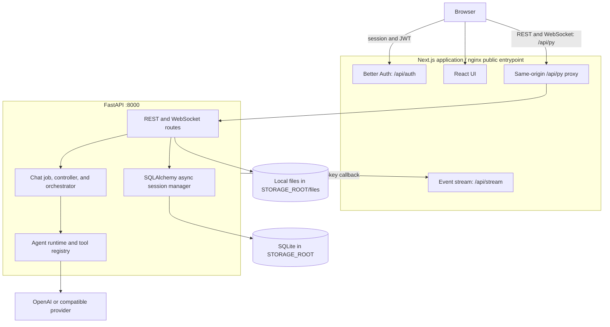

# Asterism Architecture Documentation

This directory documents the architecture implemented in the Asterism monorepo.
Asterism is a self-hosted AI chat application with a Next.js frontend, FastAPI
backend, capability-scoped main agents and sub-agents, reconnectable streamed
responses, full-text chat search, and user-owned file attachments.

## Document index

| Document                                            | Scope                                                                                           |
| --------------------------------------------------- | ----------------------------------------------------------------------------------------------- |
| [System overview](overview.md)                      | Topology, workspace layout, request, streaming, and chat-job lifecycle                          |
| [Authentication and security](auth-and-security.md) | Better Auth, JWT/JWKS verification, tenancy, and internal callbacks                             |
| [Chat and WebSocket](chat-and-websocket.md)         | Bidirectional chat protocol, reconnectable jobs, queues, cancellation, and controller lifecycle |
| [Agent runtime](agent-runtime.md)                   | Bounded LLM loop, event stream, delegation, and traces                                          |
| [Tool authorization](tool-authorization.md)         | Allowlist and interactive approval policies, child-agent boundaries                             |
| [LLM providers](llm-providers.md)                   | OpenAI and OpenAI-compatible provider configuration and capabilities                            |
| [Data and storage](data-and-storage.md)             | SQLite schema, FTS search, message tree, local file storage, and attachments                    |
| [ADR-0016: Memory resource contracts](adr-0016-memory-resource-contracts.md) | Process-lifetime state inventory, ownership, bounds, and remediation plan |

## Current deployment topology

## Design boundaries

- **Same-origin browser traffic:** the browser uses `/api/py` for FastAPI HTTP,
  WebSocket, and OpenAPI traffic. Next.js supplies the local-development proxy;
  nginx supplies the equivalent route in the combined container.
- **Authentication boundary:** Better Auth owns sessions and signing keys. FastAPI
  validates bearer and WebSocket JWTs against the frontend's loopback JWKS endpoint.
- **Capability boundary:** chat profiles supply the tool schemas offered to the
  model; interactive calls outside the chat allowlist require a user decision. A
  delegated agent executes autonomously only active tools assigned to its own
  profile.
- **Persistence boundary:** SQLAlchemy manages the relational store; uploaded bytes
  pass through the `FileStore` protocol, whose current implementation is
  `LocalFileStore`.
- **Provider boundary:** the runtime uses the OpenAI SDK. Supported configurations
  are canonical OpenAI and a generic OpenAI-compatible HTTP(S) endpoint.

## Code entry points

- Backend app: [`asterism.main:app`](../apps/backend/asterism/main.py)
- Backend lifespan: [`asterism.core.lifespan:lifespan`](../apps/backend/asterism/core/lifespan.py)
- Chat jobs and transport: [`ChatJobManager`](../apps/backend/asterism/domains/chat/jobs.py) and [`ChatController`](../apps/backend/asterism/domains/chat/controller.py)
- Agent loop: [`Agent`](../apps/backend/asterism/domains/agent/agent.py)
- Tool registry: [`tool_registry`](../apps/backend/asterism/domains/tools/registry.py)
- Frontend chat hook: [`useChatWebSocket`](../apps/frontend/src/features/chat/hooks/use-chat-websocket.tsx)
