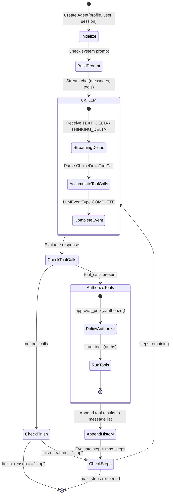
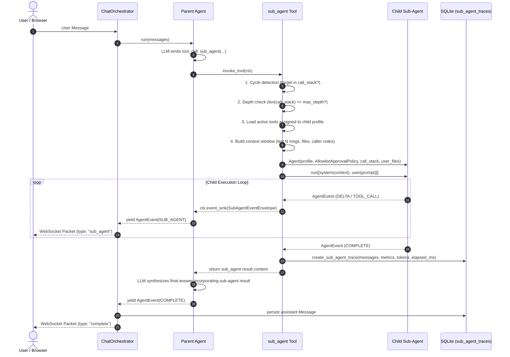
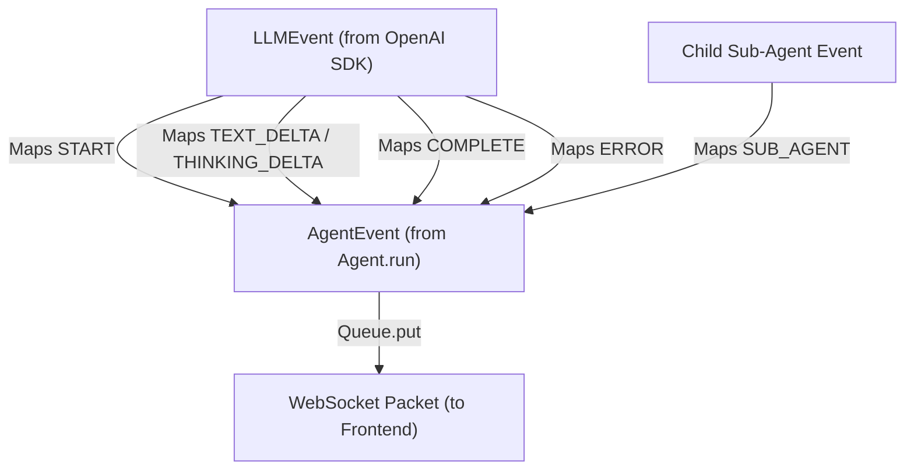

# Agent Runtime & Execution Loop

The **Agent Runtime** is the core cognitive engine of Asterism. It executes a bounded, multi-turn reasoning and acting loop that orchestrates LLM calls, parses tool invocations, dynamically builds system prompts, and handles real-time event streaming.

---

## Agent Architecture & Lifecycle

The [`Agent`](../apps/backend/asterism/domains/agent/agent.py) class encapsulates a single agent session turn. Each agent maintains a `call_stack: list[uuid.UUID]` representing the lineage of agents from the root conversation turn down to the active agent, preventing recursion cycles during delegation.

A chat is bound to one **main agent** (`sub_agent=False`) when it is created. The
caller may choose a main agent or omit it to use the user's default main agent;
the service rejects sub-agents and chats without a valid default. The persisted
binding supplies the profile, model, prompt, parameters, and offered tool schemas
for every later turn. It is not changed when the user's global default changes.
Sub-agent profiles are delegation targets, not chat entry points.



---

## Key Components

### 1. Dynamic System Prompt Construction

Agents dynamically adapt their instructions based on available capabilities:

- **Base Persona**: Loaded from [`AgentProfile.system_prompt`](../apps/backend/asterism/domains/agent/schemas.py).
- **Sub-Agent Catalog Injection**: If `sub_agent` is in the profile's configured tools, the agent queries [`get_user_agents()`](../apps/backend/asterism/domains/agent/service.py). It gathers all profiles marked with `sub_agent=True` (excluding itself) and appends their IDs, names, and descriptions to the system prompt so the LLM knows what delegation targets exist:
  ```python
  Sub Agents:
  - id: 3fa85f64-... (name: Research Agent) - Researches external web sources
  - id: 8cb123e4-... (name: Data Analyst) - Analyzes CSV and SQL datasets
  ```

### 2. Multi-Step Loop & Step Bounding

To avoid runaway loops and infinite token spend:

- Bounded by `profile.max_steps` (default 5).
- On the final step (`step + 1 >= max_steps`), `tools` are intentionally stripped from the LLM prompt. This forces the model to synthesize a final textual response rather than queuing another round of tool calls.
- Loop terminates immediately when `event.finish_reason == "stop"`.

### 3. LLM Client & Streaming Abstraction

The [`LLMClient`](../apps/backend/asterism/domains/llm/client.py) abstracts OpenAI-compatible endpoints:

- **Thinking / Reasoning**: Intercepts `thinking_delta` chunks for reasoning models (e.g., DeepSeek R1, Claude thinking, o-series) and streams them alongside standard text deltas.
- **Tool Call Chunk Accumulator**: In streaming mode, tool arguments arrive in fragmented deltas (`ChoiceDeltaToolCall`). `StreamHandler` accumulates fragments by index until complete, ensuring valid JSON strings before yielding `LLMEventType.COMPLETE`.
- **Textual Tool-Call Compatibility**: Some nominally OpenAI-compatible providers emit `<tool_call>{"tool_name": ..., "arguments": ...}</tool_call>` as assistant text instead of native `delta.tool_calls`. When no native calls are present, `StreamHandler` converts valid tagged JSON blocks into normal `ToolCall` objects, removes the protocol markup from final content, and changes the finish reason to `tool_calls`. Converted calls still pass through the normal approval policy, so hallucinated or unauthorized tool names are rejected rather than executed.
- **Automatic Retries**: Decorates API invocations with exponential backoff for rate limits and transient connection errors ([`retry_async_gen`](../apps/backend/asterism/common/retries.py)).

### 4. Sub-Agent Delegation & Recursion Boundaries

When an agent invokes the [`sub_agent`](../apps/backend/asterism/domains/tools/builtin/sub_agent.py) tool:

- **Recursion Safety**: The target agent ID is checked against `ctx.call_stack`. If an ID is already in the chain, execution aborts with a recursion cycle error.
- **Depth Limits**: The depth of the delegation chain is bounded by `config.max_sub_agent_depth` (default: 3). If exceeded, execution aborts with an actionable error.
- **Lineage Tracking**: The child agent is initialized with `call_stack=[*ctx.call_stack, target_id]` so further nested delegations are tracked accurately.
- **Event Streaming**: Sub-agent execution events (`START`, `DELTA` including thinking, `TOOL_CALL`, `COMPLETE`, and `ERROR`) are wrapped in [`SubAgentEventEnvelope`](../apps/backend/asterism/domains/agent/schemas.py) and forwarded through `ctx.event_sink`. Every invocation has a stable `execution_id`, in addition to agent identity and depth, so concurrent or repeated calls remain distinct. The parent `Agent.run()` stream yields them as `SUB_AGENT` events in real time, and the chat renders a separate delegated-activity panel without replacing the parent answer.
- **Trace Persistence**: Upon completion, the sub-agent's step count, cumulative tokens, elapsed wall-clock time, and full message exchange are persisted to `sub_agent_traces`.
- See [Sub-Agent Recursion Safety & Bounded Execution](tool-authorization.md#sub-agent-recursion-safety--bounded-execution) for authorization details.

### Sub-Agent Delegation Lifecycle



---

## Event Stream Model

The runtime yields strongly-typed [`AgentEvent`](../apps/backend/asterism/domains/agent/schemas.py) objects:



| `AgentEventType` | Content / Fields                                          | Meaning                                                                       |
| ---------------- | --------------------------------------------------------- | ----------------------------------------------------------------------------- |
| `START`          | None                                                      | Agent execution turn has started                                              |
| `DELTA`          | `content: str`, `thinking: str`                           | Incremental streaming text or reasoning tokens                                |
| `TOOL_CALL`      | `tool_calls: list[ToolCall]`                              | Agent has emitted intent to call one or more tools                            |
| `COMPLETE`       | `content: str`, `tool_results: list`, `total_tokens: int` | Turn finished; assistant message persisted                                    |
| `ERROR`          | `content: str`                                            | Execution failure or fatal exception                                          |
| `SUB_AGENT`      | `sub_agent: SubAgentEventEnvelope`                        | Correlated delegated lifecycle, thinking, text, tools, completion, and errors |

---

## Tool Execution in the Runtime

When tool calls are authorized by [`ToolApprovalPolicy`](tool-authorization.md):

1. **Parallel Invocation**: Approved tools are dispatched concurrently via `asyncio.gather()`:
   ```python
   tasks = [
       tool_registry.invoke_tool(
           tool_call=auth.tool,
           user=self.user,
           session=self.session,
           client=await self._get_client(),
           user_message=user_message or "",
           call_stack=self.call_stack,
       )
       for auth in auths if auth.accept
   ]
   ```
2. **Standardized Context**: Tools receive [`ToolContext`](../apps/backend/asterism/domains/tools/registry.py) containing validated Pydantic arguments, authenticated user identity, active chat session, database access, app settings, and lineage `call_stack`.
3. **Synthetic Rejection Results**: Any tool rejected by policy produces an error result informing the model the user denied access, prompting it to continue without that tool.

---

## Sub-Agent Context Forwarding & Windowing

When an agent delegates a task via the `sub_agent` tool:

1. **Context Window Extraction**: The parent conversation history from `ctx.session.messages` is bounded using configurable limits:
   - `config.sub_agent_context_window_messages` (default: `10`): Maximum number of recent messages to include.
   - `config.sub_agent_context_window_tokens` (default: `4000`): Maximum accumulated tokens to forward, preventing context overflow.
2. **File and Caller Propagation**:
   - `ctx.user_files`: List of uploaded user files is forwarded into the context block and passed into the child `Agent(user_files=...)`, ensuring tools executed by the sub-agent have access to `tool_ctx.user_files`.
   - `args.parent_context`: Optional caller-specified notes or summaries are included under `### Caller Notes`.
3. **Structured System-Level Delineation**:
   The sub-agent's message list is constructed with clear separation:
   - **Index 0**: Sub-agent's own system prompt (`_build_system_prompt()`), establishing persona and allowed capabilities.
   - **Index 1**: System context message (`--- FORWARDED PARENT CONTEXT ---`) containing recent conversation history, available user files, and caller notes.
   - **Index 2**: User message containing the delegated task prompt.

---

## Sub-Agent Execution Trace Persistence

To provide comprehensive auditability and debugging for delegated agent workflows, Asterism records every sub-agent execution:

1. **Storage Schema**: Traces are stored in the `sub_agent_traces` table ([`SubAgentTraceModel`](../apps/backend/asterism/domains/agent/models.py)), indexed by `parent_message_id`, `sub_agent_id`, and `user_id`.
2. **Metrics & Trajectory Recorded**:
   - `parent_message_id`: Foreign key association to the parent chat message triggering delegation.
   - `sub_agent_id` / `sub_agent_name`: Target profile identity.
   - `prompt`: The delegated task instructions.
   - `caller_context`: Optional caller-supplied context or notes.
   - `messages`: Complete serialized JSON message exchange (system prompt, forwarded parent context, user prompt, assistant reasoning, tool calls, and tool result observations).
   - `result`: Final response content.
   - `step_count`: Number of reasoning turns executed.
   - `total_tokens`: Cumulative token usage across all steps.
   - `elapsed_ms`: Wall-clock execution time in milliseconds.
   - `depth`: Call-chain nesting level from root.
3. **Query Interface**: Traces are queryable programmatically via [`get_sub_agent_traces_by_parent_message()`](../apps/backend/asterism/domains/agent/service.py) and via REST API endpoint `GET /agents/traces/{parent_message_id}`. Results are scoped to the authenticated user.
4. **Runtime Diagnostics**: Python console logs record `requested`, `authorized`, `started`, per-event debug metadata, `finished`, and trace-persistence outcomes. Logs correlate on `execution_id`, agent/chat/parent-message identifiers, depth, duration, counts, and status; raw prompts and generated content are intentionally excluded.

Frontend WebSocket-contract E2E coverage uses the test-only `/e2e/sub-agent` harness (unavailable outside the `test` configuration profile) to verify successful progress/final-parent rendering and delegated timeout rendering. Backend integration coverage exercises the parent tool call, child event forwarding, child result return, and parent synthesis with deterministic LLM doubles; live external-provider behavior remains dependent on configured provider availability and credentials.

---

## Related Documentation

- [Tool Authorization & Approval](tool-authorization.md)
- [Chat & Real-Time WebSocket](chat-and-websocket.md)
- [System Overview](overview.md)
