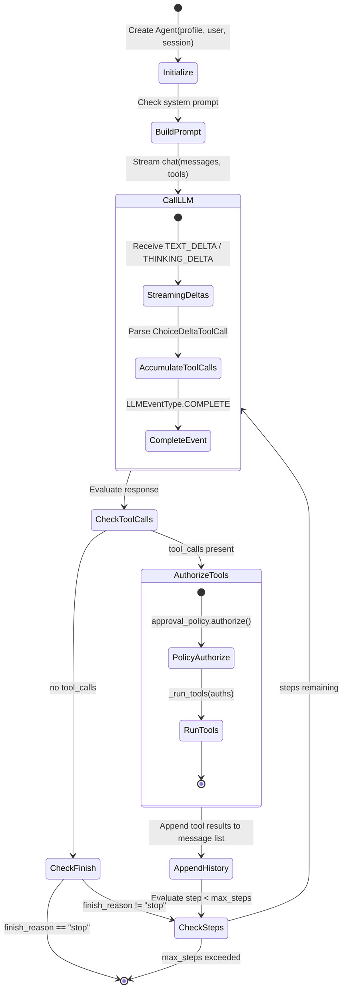
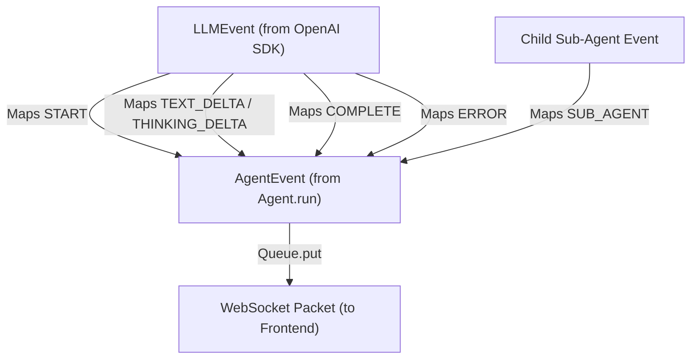

# Agent Runtime & Execution Loop

The **Agent Runtime** is the core cognitive engine of Asterism. It executes a bounded, multi-turn reasoning and acting loop that orchestrates LLM calls, parses tool invocations, dynamically builds system prompts, and handles real-time event streaming.

---

## Agent Architecture & Lifecycle

The [`Agent`](../apps/backend/asterism/domains/agent/agent.py) class encapsulates a single agent session turn. Each agent maintains a `call_stack: list[uuid.UUID]` representing the lineage of agents from the root conversation turn down to the active agent, preventing recursion cycles during delegation.



---

## Key Components

### 1. Dynamic System Prompt Construction

Agents dynamically adapt their instructions based on available capabilities:

- **Base Persona**: Loaded from [`AgentProfile.system_prompt`](../apps/backend/asterism/domains/agent/schemas.py).
- **Sub-Agent Catalog Injection**: If `sub_agent` is in the profile's allowed tools, the agent queries [`get_user_agents()`](../apps/backend/asterism/domains/agent/service.py). It gathers all profiles marked with `sub_agent=True` (excluding itself) and appends their IDs, names, and descriptions to the system prompt so the LLM knows what delegation targets exist:
  ```python
  Sub Agents:
  - id: 3fa85f64-... (name: Research Agent) - Researches external web sources
  - id: 8cb123e4-... (name: Data Analyst) - Analyzes CSV and SQL datasets
  ```

### 2. Multi-Step Loop & Step Bounding

To avoid runaway loops and infinite token spend:

- Bounded by `profile.max_steps` (default 5).
- On the final step (`step + 1 >= max_steps`), `tools` are intentionally stripped from the LLM prompt. This forces the model to synthesize a final textual response rather than queuing another round of tool calls.
- Loop terminates immediately when `event.finish_reason == "stop"`.

### 3. LLM Client & Streaming Abstraction

The [`LLMClient`](../apps/backend/asterism/domains/llm/client.py) abstracts OpenAI-compatible endpoints:

- **Thinking / Reasoning**: Intercepts `thinking_delta` chunks for reasoning models (e.g., DeepSeek R1, Claude thinking, o-series) and streams them alongside standard text deltas.
- **Tool Call Chunk Accumulator**: In streaming mode, tool arguments arrive in fragmented deltas (`ChoiceDeltaToolCall`). `StreamHandler` accumulates fragments by index until complete, ensuring valid JSON strings before yielding `LLMEventType.COMPLETE`.
- **Automatic Retries**: Decorates API invocations with exponential backoff for rate limits and transient connection errors ([`retry_async_gen`](../apps/backend/asterism/common/retries.py)).

### 4. Sub-Agent Delegation & Recursion Boundaries

When an agent invokes the [`sub_agent`](../apps/backend/asterism/domains/tools/builtin/sub_agent.py) tool:

- **Recursion Safety**: The target agent ID is checked against `ctx.call_stack`. If an ID is already in the chain, execution aborts with a recursion cycle error.
- **Depth Limits**: The depth of the delegation chain is bounded by `config.max_sub_agent_depth` (default: 3). If exceeded, execution aborts with an actionable error.
- **Lineage Tracking**: The child agent is initialized with `call_stack=[*ctx.call_stack, target_id]` so further nested delegations are tracked accurately.
- **Event Streaming**: Sub-agent execution events (`DELTA`, `TOOL_CALL`, `COMPLETE`) are wrapped in [`SubAgentEventEnvelope`](../apps/backend/asterism/domains/agent/schemas.py) and forwarded through `ctx.event_sink`. The parent `Agent.run()` stream yields them as `SUB_AGENT` events in real-time, preventing delegated work from becoming a frozen black box.
- See [Sub-Agent Recursion Safety & Bounded Execution](tool-authorization.md#sub-agent-recursion-safety--bounded-execution) for full details.

---

## Event Stream Model

The runtime yields strongly-typed [`AgentEvent`](../apps/backend/asterism/domains/agent/schemas.py) objects:



| `AgentEventType` | Content / Fields                                          | Meaning                                            |
| ---------------- | --------------------------------------------------------- | -------------------------------------------------- |
| `START`          | None                                                      | Agent execution turn has started                   |
| `DELTA`          | `content: str`, `thinking: str`                           | Incremental streaming text or reasoning tokens     |
| `TOOL_CALL`      | `tool_calls: list[ToolCall]`                              | Agent has emitted intent to call one or more tools |
| `COMPLETE`       | `content: str`, `tool_results: list`, `total_tokens: int` | Turn finished; assistant message persisted         |
| `ERROR`          | `content: str`                                            | Execution failure or fatal exception               |
| `SUB_AGENT`      | `sub_agent: SubAgentEventEnvelope`                        | Delegated child agent activity (thinking, text, tools) |

---

## Tool Execution in the Runtime

When tool calls are authorized by [`ToolApprovalPolicy`](tool-authorization.md):

1. **Parallel Invocation**: Approved tools are dispatched concurrently via `asyncio.gather()`:
   ```python
   tasks = [
       tool_registry.invoke_tool(
           tool_call=auth.tool,
           user=self.user,
           session=self.session,
           client=await self._get_client(),
           user_message=user_message or "",
           call_stack=self.call_stack,
       )
       for auth in auths if auth.accept
   ]
   ```
2. **Standardized Context**: Tools receive [`ToolContext`](../apps/backend/asterism/domains/tools/registry.py) containing validated Pydantic arguments, authenticated user identity, active chat session, database access, app settings, and lineage `call_stack`.
3. **Synthetic Rejection Results**: Any tool rejected by policy produces an error result informing the model the user denied access, prompting it to continue without that tool.

---

## Related Documentation

- [Tool Authorization & Approval](tool-authorization.md)
- [Chat & Real-Time WebSocket](chat-and-websocket.md)
- [System Overview](README.md)
