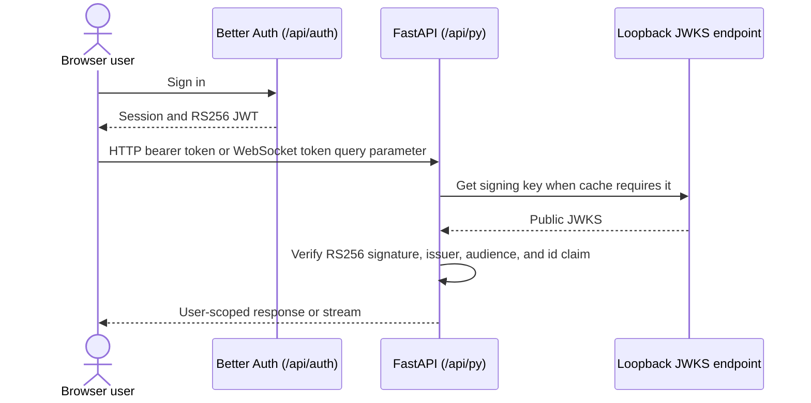

# Authentication and Security Architecture

Asterism uses Better Auth in Next.js for sessions and RS256 JWT issuance. FastAPI
does not share a signing secret or trust a browser-supplied identity: it retrieves
public signing keys from Better Auth's JWKS endpoint and validates each token.

## Authentication flow

`PUBLIC_URL` is the sole public identity setting. It supplies FastAPI's expected
JWT issuer and audience. The backend reaches JWKS through the fixed loopback
frontend address (`http://127.0.0.1:3000/api/auth/jwks`), so public DNS and TLS
termination are not part of this internal hop.

## Security controls

### JWT verification

[`verify_jwks_token`](../apps/backend/asterism/core/security.py) uses
`jwt.PyJWKClient` with a one-hour JWKS/key cache. It accepts only RS256, validates
issuer and audience, and requires the `id` claim before constructing an
`AuthedUser`. REST dependencies obtain the bearer token through `HTTPBearer`; the
chat WebSocket validates its required `token` query parameter before accepting the
connection.

### User and administrator boundaries

Backend services pass the authenticated user ID into queries for user-owned chats,
messages, folders, files, agent profiles, and settings. File routes additionally
resolve stored paths below that user's file root. Provider administration and other
administrator operations use the user's authenticated role; provider credentials are
write-only in API responses.

### Internal callbacks

The backend event bus can POST to the Next.js `/api/stream` route for events such
as chat-title updates. This loopback callback carries
`x-asterism-system-key`; the route accepts it only when it equals the server-side
`SYSTEM_KEY`. The key is not a JWT signing key and must never be sent to the browser.
The stream route can also accept an authenticated frontend session, rate-limits
requests, and filters emitted events by user ID for SSE subscribers.

### Deployment safeguards

- The supported image exposes only port 3000. nginx routes `/api/py/` to FastAPI
  on loopback and keeps ports 8000 and 3001 private.
- nginx's access-log format omits query strings because chat WebSocket URLs contain
  JWTs.
- Runtime configuration rejects wildcard CORS origins and invalid public origins in
  full runtime profiles. Production requires HTTPS for non-loopback public origins.
- Secrets use the root configuration contract or canonical `/run/secrets` files;
  see the root [README](../README.md#configuration).

## Related guides

- [System overview](overview.md)
- [Chat and WebSocket](chat-and-websocket.md)
- [Tool authorization](tool-authorization.md)
