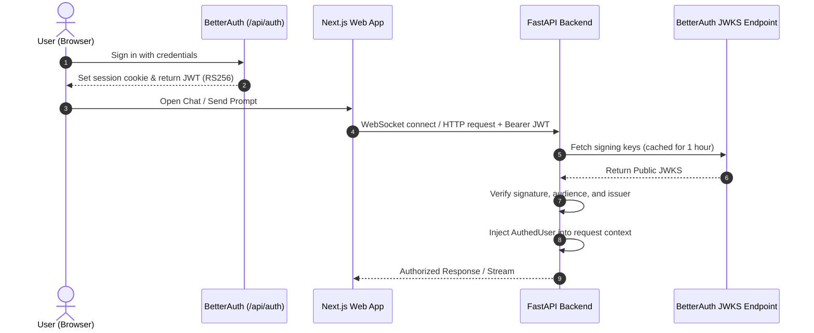

# Authentication & Security Architecture

Asterism implements a federated authentication model combining **BetterAuth** in the Next.js frontend with **JWKS-based RS256 token verification** in the FastAPI backend.

---

## Authentication Flow



---

## Security Layers

### 1. Token Verification ([`core/security.py`](../apps/backend/asterism/core/security.py))

- **Cryptographic Verification**: Tokens are signed using asymmetric **RS256** keys. The backend retrieves public keys dynamically from `config.jwks_url` using `jwt.PyJWKClient`.
- **Key Caching**: Public keys and JWKS sets are cached in-memory for 1 hour (`lifespan=3600`), minimizing network round-trips to the frontend auth service.
- **Strict Claims Checking**: Validates `aud` (audience) and `iss` (issuer) against environment configuration derived from `PUBLIC_URL`.

### 2. Tenancy & User Isolation

- Every database query for user-owned assets (`chats`, `messages`, `folders`, `agent_profiles`, `user_settings`) enforces strict scoping:
  ```python
  stmt = select(ChatModel).where(
      ChatModel.id == chat_id,
      ChatModel.user_id == user.id,
  )
  ```
- Attempting to access an asset owned by another user yields an immediate `401 Unauthorized` or `404 Not Found`.

### 3. Internal System Key (`x-asterism-system-key`)

For backend-to-frontend callbacks (such as asynchronous chat title updates or push webhooks to `/api/stream`):

- Protected by a shared high-entropy secret (`SYSTEM_KEY`).
- Injected via HTTP header: `x-asterism-system-key`.
- Frontend rejects unauthorized push events without the matching system key.

---

## Related Documentation

- [System Overview](README.md)
- [Tool Authorization & Approval](tool-authorization.md)
- [Data Model & Storage](data-and-storage.md)
