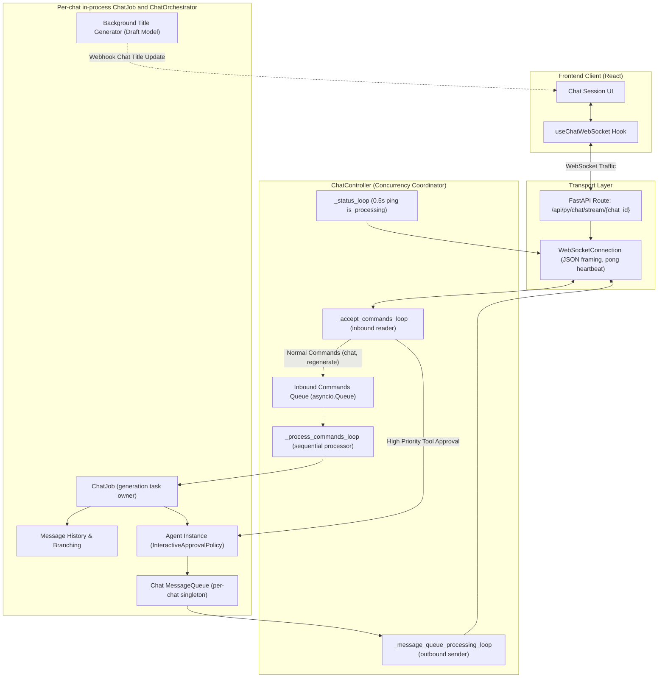

# Chat & Real-Time WebSocket Architecture

Asterism provides real-time, bidirectional streaming chat between the user and AI agents. This document describes the architecture of the WebSocket subsystem, focusing on the decoupling of connection handling, command processing, and event emission.

---

## WebSocket Subsystem Architecture

The real-time streaming layer is structured into three distinct responsibilities:



---

## The Core Trio

### 1. `WebSocketConnection`

[`WebSocketConnection`](../apps/backend/asterism/domains/chat/connection.py) encapsulates the raw FastAPI `WebSocket` instance.

- **Message Framing**: Serializes and deserializes JSON messages safely.
- **Heartbeat Loop**: Sends a `pong` packet every 10 seconds while the connection is open; clients can also send a `ping` command.
- **Clean Disconnects**: Catches `WebSocketDisconnect` and ensures underlying resources close properly without uncaught traceback spam.

### 2. `ChatJob` and `ChatController`

[`ChatJobManager`](../apps/backend/asterism/domains/chat/jobs.py) holds one in-process
`ChatJob` per chat ID. The first socket creates its `ChatOrchestrator`; subsequent
sockets attach controllers to that same job. The job owns the generation task, so a
socket disconnect only stops its connection-owned workers and does not cancel a
provider request. A `cancel` command explicitly cancels the job; the orchestrator
persists the user turn as cancelled and retains any streamed assistant text as a
cancelled partial message. Jobs are process-local: a backend restart does not
resume an in-flight provider request.

[`ChatController`](../apps/backend/asterism/domains/chat/controller.py) coordinates a connection and isolates failure domains:

- **Background Worker Management**: Uses [`BackgroundTaskManager`](../apps/backend/asterism/core/tasks.py) to manage worker coroutines, ensuring clean cancellation on client disconnect.
- **Command Prioritization**:
  - Regular commands (`chat`, `regenerate`) go to `inbound_commands` to execute sequentially.
  - Urgent commands (`tool_approval`) bypass sequential processing and immediately resolve the orchestrator's pending future, preventing deadlocks when the agent is waiting for user consent.
- **Auto-Start Injection**: The message processor automatically tracks event sequences and injects a `START` event if the LLM fails to yield one before deltas.
- **Reconnect behavior**: An attached controller starts generation only if the job is idle and the shared outbound queue is empty; it never creates a second run for an active chat.

### 3. `ChatOrchestrator`

[`ChatOrchestrator`](../apps/backend/asterism/domains/chat/orchestrator.py) owns the chat state and coordinates the agent:

- **Tree Branching**: Manages tree relationships (`parent_message_id`, `active_child_id`) for branch navigation and regeneration.
- **Persistence**: Persists new messages, token counts, tool calls, and tool results into the database through [`chat_service`](../apps/backend/asterism/domains/chat/service.py).
- **Background Title Generation**: Uses a fast draft model ([`get_draft_model()`](../apps/backend/asterism/domains/llm/draft.py)) to synthesize short, 3-6 word chat titles in the background without holding up message streaming.
- **Webhook Broadcast**: When titles change, emits a webhook (`chat-session:update`) over the backend event bus to inform the frontend UI immediately.

---

## Concurrency and Worker Loops

When a client connects to `/api/py/chat/stream/{chat_id}?token={jwt}`, `ChatController.run()` initiates several concurrent coroutines:

| Worker / Loop                      | Interval / Trigger                | Purpose                                                                                      |
| ---------------------------------- | --------------------------------- | -------------------------------------------------------------------------------------------- |
| `connection.heartbeat_loop()`      | Every 10 seconds                  | Sends a `pong` heartbeat while the socket is open                                            |
| `job.start_title_generation()`     | One-off per in-process chat job   | Generates smart title using draft LLM; retries are bounded and fall back to the first prompt |
| `_status_loop()`                   | Every 0.5s                        | Emits `{"type": "status", "is_processing": bool}` to toggle UI loading spinners              |
| `_message_queue_processing_loop()` | Event-driven (`queue.get()`)      | Flushes outbound events (`DELTA`, `TOOL_CALL`, `COMPLETE`) to the client                     |
| `_accept_commands_loop()`          | Event-driven (`socket.receive()`) | Ingests client commands; routes `tool_approval` immediately                                  |
| `_process_commands_loop()`         | Queue-driven (`inbound.get()`)    | Executes `handle_new_user_message` or `_regenerate` sequentially                             |

---

## Client Protocol Specification

### Client to Server Messages

```typescript
// Sending a new user prompt with already-uploaded file names
{
  "type": "chat",
  "message": "Can you analyze recent sales figures?",
  "files": ["sales.pdf", "chart.png"]
}

// Approving or rejecting a tool call
{
  "type": "tool_approval",
  "tool_id": "call_987xyz",
  "approved": true,
  "always_allow": false
}

// Regenerating from a prior turn
{
  "type": "regenerate",
  "parent_message_id": "8cb123e4-..."
}

// Explicitly stop the active generation; disconnecting does not stop it.
{ "type": "cancel" }

// Keepalive ping
{
  "type": "ping"
}
```

### Server to Client Messages

```typescript
// Start of turn
{ "type": "start" }

// Streaming content token
{
  "type": "delta",
  "content": "Sure, let me check...",
  "thinking": "User wants sales analysis; need retrieval tool."
}

// Tool call declaration
{
  "type": "tool_call",
  "tool_calls": [{ "id": "call_987xyz", "function": { "name": "sql_query", "arguments": "..." } }]
}

// Interactive approval request
{
  "type": "tool_permission_request",
  "id": "call_987xyz",
  "name": "sql_query",
  "arguments": "{\"query\": \"SELECT * FROM sales;\"}"
}

// Tool permission prompt cleared
{
  "type": "tool_update",
  "id": "call_987xyz"
}

// Processing status heartbeat
{
  "type": "status",
  "is_processing": true
}

// Delegated sub-agent execution event
{
  "type": "sub_agent",
  "execution_id": "9bda5c59-0235-4b8c-b53e-d8cb0bfbdc2c",
  "sub_agent_id": "3fa85f64-5717-4562-b3fc-2c963f66afa6",
  "sub_agent_name": "Research Agent",
  "depth": 1,
  "event": {
    "type": "delta",
    "content": "Searching online sources...",
    "thinking": "Looking for revenue numbers."
  }
}

// The nested event can be start, delta, tool_call, complete, or error.
// The UI groups packets by execution_id and keeps the child result separate
// from the final parent response.

// Turn complete
{
  "type": "complete",
  "last_messages": [ /* Array of updated serialized Message objects */ ]
}
```

---

## File attachments

The composer uploads selected files before it sends the WebSocket command. The orchestrator validates each filename against the authenticated user's `user_files` records, processes pending files, and persists typed references on the user message. Invalid, duplicate, deleted, or cross-user names fail before the message is persisted. On history rebuild and regeneration, cached document/text content is injected as text; an image is encoded as an OpenAI-compatible `image_url` part only when the resolved model has `supports_vision == true` and the image is within the configured vision-byte limit. Missing, unsupported, failed, oversized, and non-vision images become explicit text notices rather than model input.

The chat `GET` response also supplies an estimated context payload. It uses the same
assembled messages, system prompt, tool schemas, text-token estimator, and a
conservative fixed allowance per accepted image as the runtime path. Provider
reported completion usage remains authoritative; this estimate is advisory and is
shown with the model's configured context window when known.

## Related Documentation

- [Tool Authorization & Approval](tool-authorization.md)
- [Agent Runtime & Execution Loop](agent-runtime.md)
- [System Overview](overview.md)
