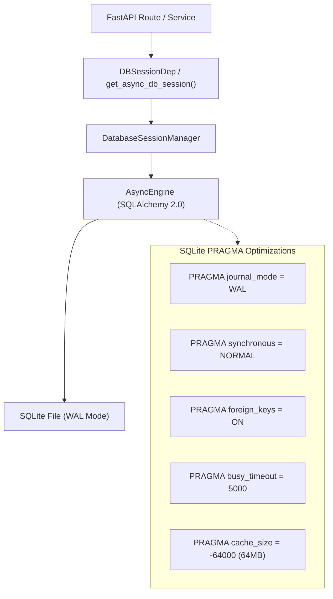
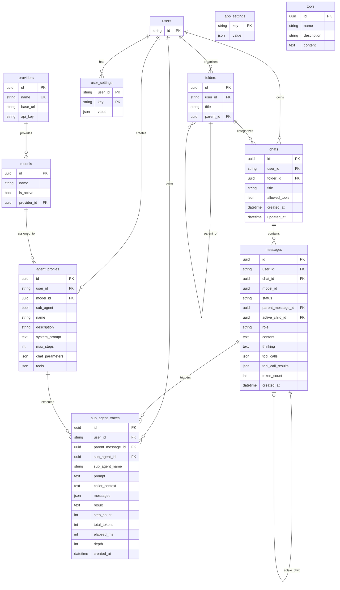
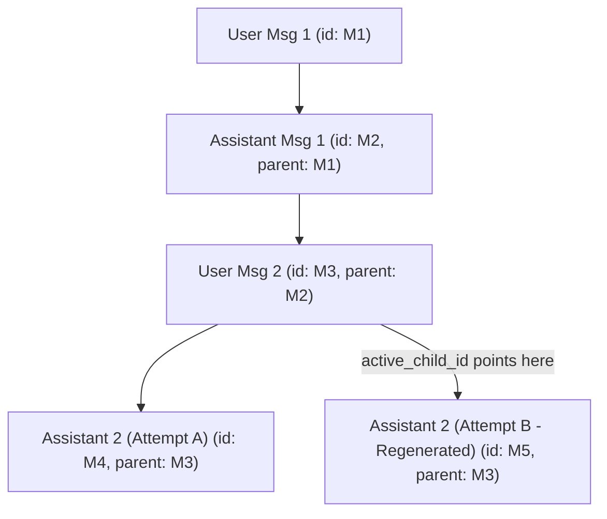

# Data Model & Storage Architecture

Asterism's persistence layer is engineered for high-concurrency local development and production deployments while maintaining clean abstraction boundaries for future database engine swaps.

---

## Storage Engine Architecture

The backend database system is managed by [`DatabaseSessionManager`](../apps/backend/asterism/db/database.py) using SQLAlchemy 2.0 Asyncio.

### High-Concurrency SQLite Configuration

Asterism applies production-grade PRAGMA settings upon establishing every raw connection:

1. **Write-Ahead Logging (`WAL`)**: Allows concurrent readers without blocking writers, and writers without blocking readers.
2. **Synchronous Normal (`NORMAL`)**: Drastically reduces filesystem sync operations without risking database corruption in WAL mode.
3. **Foreign Keys Enforcement (`foreign_keys = ON`)**: Ensures cascade deletions (`ondelete="CASCADE"`) work reliably at the SQLite engine level.
4. **Busy Timeout (`busy_timeout = 5000`)**: Waits up to 5 seconds during lock contention rather than immediately failing with `database is locked`.
5. **Memory Cache (`cache_size = -64000`)**: Allocates 64MB of in-memory page cache for lightning-fast queries.

---

## Entity Relationship Diagram (ERD)

---

## The Message Tree Model

Asterism models conversation history as a **directed acyclic tree** rather than a flat linear list.

### Tree Capabilities

- **Regeneration without Data Loss**: When the user requests regeneration, the original assistant response is kept in the database with its tool calls and reasoning. The parent message's `active_child_id` is simply pointed to the newly generated child message.
- **Branch Traversal**: Clients can inspect siblings (`has_siblings`, `sibling_count`, `current_sibling_index`) and switch branches without destroying alternate histories.

---

## JSONB Columns & Serialization

Asterism provides type-safe JSON serialization directly into SQLite columns using [`JSONB_COLUMN`](../apps/backend/asterism/db/columns.py):

- Supports SQLite 3.45+ native `JSONB` binary formats where supported, falling back cleanly to text JSON.
- Built-in integration with **Pydantic `TypeAdapter`**, ensuring stored JSON is validated and deserialized directly into strong domain types (such as `list[ToolCall]`, `list[ToolResult]`, and `ChatCompletionParams`).

---

## User file storage

Uploaded files are owned by one user and stored through the `FileStore` interface; the current `LocalFileStore` places bytes below `{storage_root}/files/{user_id}`. Metadata, ownership, hash, classification, and bounded processing cache live in `user_files`. `messages.files` stores only typed references, so deleting a file removes its bytes and row without rewriting history; affected historical attachments render as unavailable.

The upload API is authenticated and user-scoped (`POST`, `GET`, and `DELETE /files`). It sanitizes and deduplicates names, rejects configured executable extensions and oversized files, and never exposes another user's bytes or metadata. The repeatable schema migrations create `user_files` and add `messages.files` without modifying existing message content.

## Related Documentation

- [System Overview](README.md)
- [Chat & Real-Time WebSocket](chat-and-websocket.md)
- [Agent Runtime & Execution Loop](agent-runtime.md)
