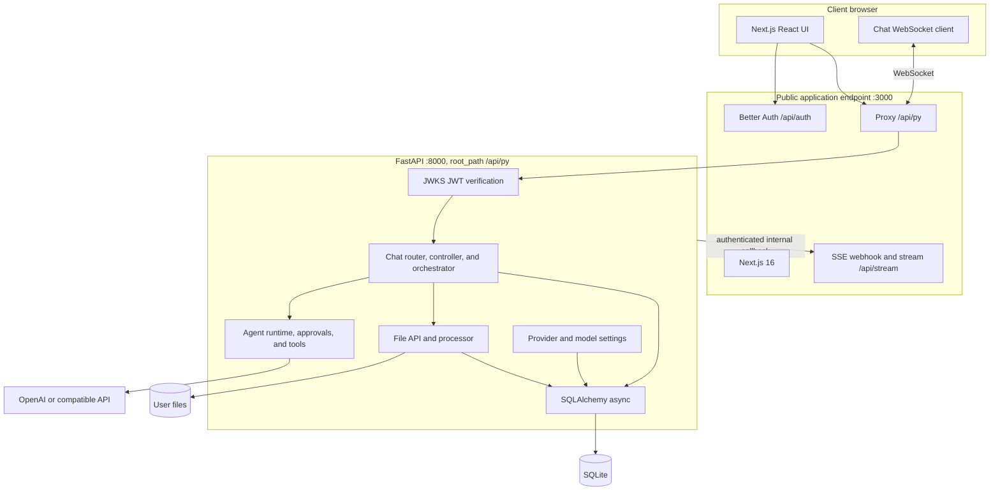

# System Overview

Asterism is a pnpm workspace containing a Next.js 16 frontend and a Python 3.13+
FastAPI backend. The browser talks to the backend only through the public,
same-origin `/api/py` prefix; the backend handles chat, agent execution, files,
settings, and tools.

## Topology



In development, Next.js rewrites `/api/py/*` to loopback FastAPI on port 8000. In
the supported container image, nginx proxies that path to the same backend and
proxies all other public traffic to Next.js. The browser never needs an internal
backend URL.

## Technology stack

| Layer | Implementation |
| --- | --- |
| Web UI | Next.js 16, React 19, Tailwind CSS 4, shadcn/ui |
| Authentication | Better Auth with RS256 JWTs and JWKS |
| Backend | FastAPI, Uvicorn, Pydantic |
| Persistence | SQLAlchemy async, SQLite 3.45+ in WAL mode |
| API client | Hey API generated from FastAPI OpenAPI |
| LLM runtime | OpenAI Python SDK for OpenAI and compatible endpoints |
| Files | `FileStore` protocol, `LocalFileStore`, and MarkItDown conversion |

## Workspace layout

```text
asterism/
├── apps/
│   ├── backend/                 # FastAPI package, migrations, and pytest tests
│   │   └── asterism/domains/    # agent, chat, files, settings, tools, and user domains
│   └── frontend/                # Next.js application, generated API client, and Playwright tests
├── architecture/                # This implementation documentation
├── docs/adr/                    # Architecture decision records
├── docker/                      # Combined-container configuration and smoke checks
├── scripts/                     # Root environment and workspace helpers
├── epics/                       # Product plans
└── todo.md                      # Execution history
```

## Request lifecycle

1. The browser authenticates with Better Auth and obtains the session/JWT used by
   the generated API client. HTTP uses a bearer token; the chat socket carries its
   token in the WebSocket query string.
2. The public application forwards `/api/py` traffic to FastAPI. FastAPI verifies
   the JWT against `http://127.0.0.1:3000/api/auth/jwks`, checks issuer and
   audience derived from `PUBLIC_URL`, and scopes data access to the token's user.
3. A chat WebSocket creates a `ChatController` and `ChatOrchestrator`. A chat
   command persists the user message and attachment references before invoking the
   configured `Agent`.
4. The agent streams text, reasoning, tool-call, and delegated-agent events. Tool
   approval decisions return through the same WebSocket; final messages and tool
   results are persisted in SQLite.
5. The backend uses the shared system key only for loopback callbacks to
   `/api/stream`, such as asynchronous title updates. The frontend fans those
   callbacks out to authenticated SSE clients.

## Related guides

- [Authentication and security](auth-and-security.md)
- [Chat and WebSocket](chat-and-websocket.md)
- [Agent runtime](agent-runtime.md)
- [Data and storage](data-and-storage.md)
