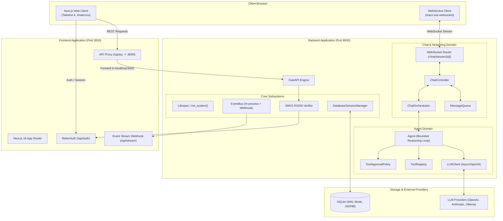

# System Overview & Architecture Topology

**Asterism** is a full-stack, multi-agent AI system designed around coordinated agents that collaborate to accomplish complex user tasks.

---

## High-Level Architecture Topology



---

## Technology Stack

| Layer                  | Technologies                                  | Rationale                                                    |
| ---------------------- | --------------------------------------------- | ------------------------------------------------------------ |
| **Frontend Framework** | Next.js 16 (React 19), App Router             | High performance, server-side rendering, seamless routing    |
| **Styling & UI**       | Tailwind CSS 4, shadcn/ui                     | Modern, responsive, accessible design system                 |
| **Authentication**     | BetterAuth + JWT (RS256) + JWKS               | Self-hosted authentication with federated token verification |
| **Backend Framework**  | Python 3.13+, FastAPI, Uvicorn                | Async performance, auto-generated OpenAPI, type hints        |
| **Database & ORM**     | SQLite 3.45+ (WAL mode), SQLAlchemy 2.0 Async | Single-file zero-config setup optimized for high concurrency |
| **API Client**         | Hey API (Type-safe client)                    | Auto-generated TypeScript types synced with FastAPI OpenAPI  |
| **LLM Integration**    | AsyncOpenAI with custom chunk accumulation    | Streaming text, thinking/reasoning deltas, function calling  |

---

## Monorepo Layout

Asterism is structured as a **pnpm monorepo**:

```text
asterism/
├── apps/
│   ├── backend/               # FastAPI backend
│   │   ├── asterism/
│   │   │   ├── common/        # Concurrency, logging, retries, schemas
│   │   │   ├── core/          # Config, events, lifespan, security
│   │   │   ├── db/            # Database session, base models, JSONB column
│   │   │   └── domains/       # Domain modules: agent, chat, tools, llm, user...
│   │   └── tests/             # Backend pytest suite
│   └── frontend/              # Next.js frontend
│       ├── src/
│       │   ├── app/           # Next.js App Router pages and APIs
│       │   ├── components/    # Reusable UI components
│       │   ├── features/      # Feature modules (chat, dashboard, settings)
│       │   └── lib/           # Hey API generated client, auth client
│       └── e2e/               # Playwright end-to-end test suite
├── architecture/              # System architecture documentation (you are here)
├── docs/                      # ADRs and decision logs
├── epics/                     # Agile epic specifications
├── AGENTS.md                  # Development playbook & coding standards
└── todo.md                    # Active task tracking
```

---

## Request & Streaming Lifecycle

1. **Client Request**:
   - The user opens a chat session in the browser. The frontend connects to the WebSocket stream endpoint at `/chat/stream/{chat_id}?token={jwt}`.
2. **Authentication Verification**:
   - The backend validates the JWT against the local JWKS endpoint (`http://localhost:3000/api/auth/jwks`) via [`verify_jwks_token`](../apps/backend/asterism/core/security.py).
3. **Session Initialization**:
   - [`ChatController`](../apps/backend/asterism/domains/chat/controller.py) spawns background loops for connection heartbeat, title generation, status monitoring, and outbound event streaming.
4. **Agent Execution**:
   - When a user message arrives, [`ChatOrchestrator`](../apps/backend/asterism/domains/chat/orchestrator.py) creates an [`Agent`](../apps/backend/asterism/domains/agent/agent.py) instance and invokes `agent.run()`.
5. **Streaming & Tool Authorization**:
   - The LLM streams tokens and tool call proposals.
   - If tools require interactive authorization, the execution suspends while the orchestrator prompts the frontend via WebSocket. Upon approval, tools run concurrently.
6. **Persistence & Completion**:
   - Assistant responses and tool results are saved to SQLite. A `complete` event flushes the final message tree state back to the UI.

---

## Related Documentation

- [Tool Authorization & Approval Architecture](tool-authorization.md)
- [Agent Runtime & Execution Loop](agent-runtime.md)
- [Chat & Real-Time WebSocket](chat-and-websocket.md)
- [Data Model & Storage](data-and-storage.md)
- [Authentication & Security](auth-and-security.md)
