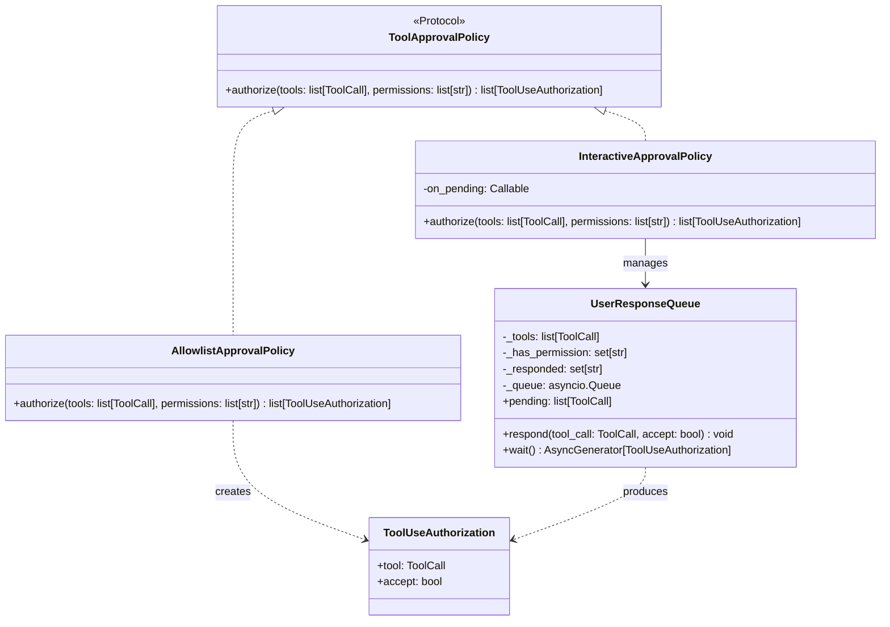
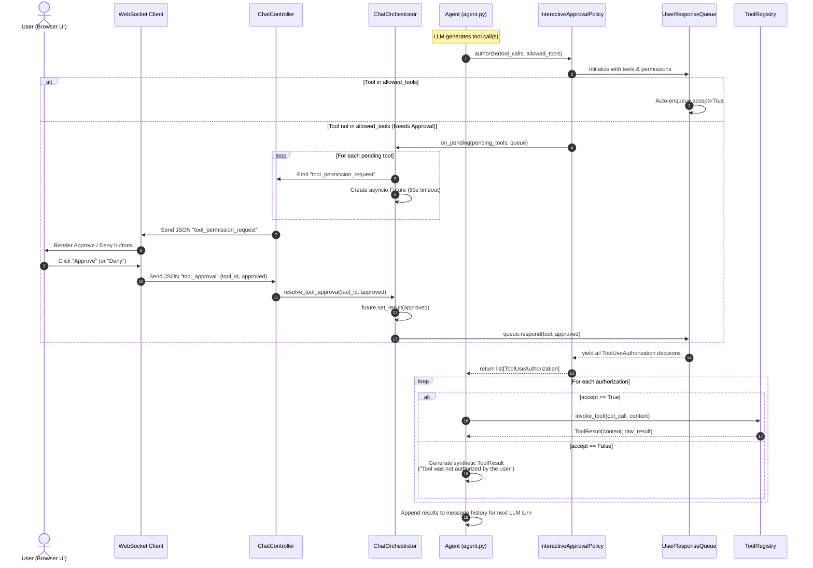
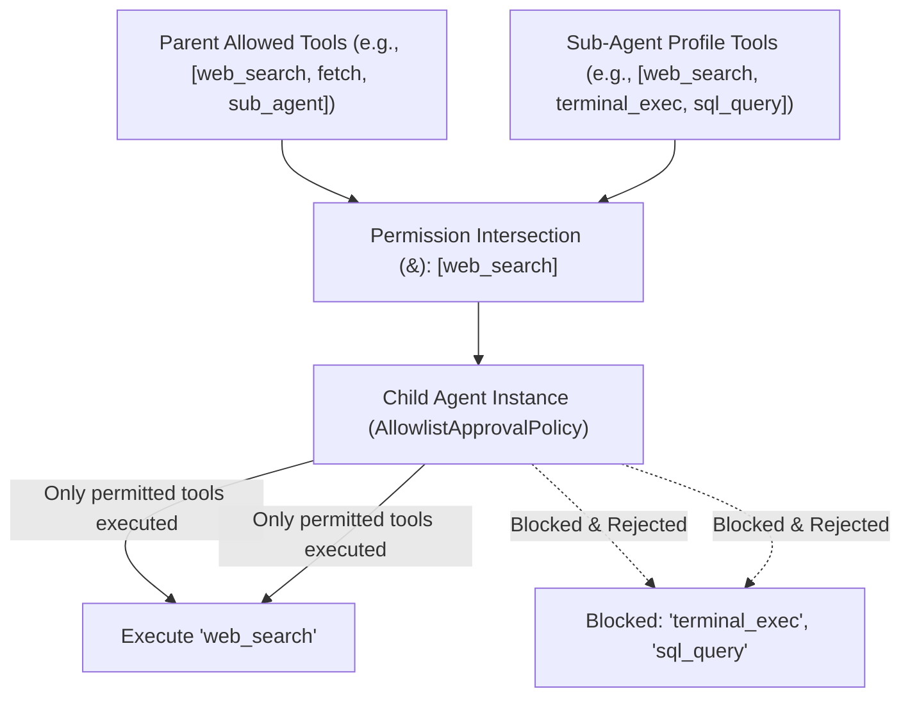

# Tool Authorization & Approval Architecture

Tool calling in AI systems introduces significant security and operational challenges:

- **Security & Privilege Escalation**: Agents must never execute tools beyond their explicit allowlist. Sub-agents must never inherit permissions greater than their parent.
- **Human-in-the-Loop Coordination**: When a tool requires explicit human approval, execution must pause without blocking the entire server or freezing the user interface.
- **Asynchronous Protocol Crossing**: Authorization decisions span across the Python agent execution loop, an in-memory message queue, a WebSocket transport layer, and a React frontend.
- **Timeout & Failure Safety**: Network drops or user hesitation must not leak background tasks or stall the agent indefinitely.

This document details Asterism's pluggable **Tool Authorization Architecture**, centered on [`ToolApprovalPolicy`](../apps/backend/asterism/domains/agent/approval.py) and interactive WebSocket coordination.

---

## Architecture Overview & Pluggable Policy

Tool authorization is decoupled from the agent execution loop via the `ToolApprovalPolicy` protocol:



### 1. `AllowlistApprovalPolicy`

- **Purpose**: Autonomous, zero-latency authorization for background jobs, automated tasks, and sub-agents.
- **Behavior**: Inspects each tool call in the batch. If `tool.function.name` is present in `permissions`, it is approved (`accept=True`); otherwise rejected (`accept=False`).
- **Coordination**: Fully synchronous and immediate.

### 2. `InteractiveApprovalPolicy`

- **Purpose**: Human-in-the-loop validation for interactive chat sessions.
- **Behavior**:
  1. Pre-approved tools (matching the agent's allowlist) are immediately marked approved.
  2. Tools not in the allowlist are flagged as `pending`.
  3. If pending tools exist, the policy triggers the `on_pending` callback.
  4. The caller (the chat orchestrator) broadcasts approval requests to the UI and awaits user input.
  5. The policy returns only after all tool decisions are resolved or timed out.

---

## Detailed Interactive Tool Approval Flow

The interactive tool authorization flow spans multiple layers across the stack:



---

## Step-by-Step Breakdown

### 1. Tool Call Detection in the Agent Loop

When the LLM finishes streaming its response, [`Agent.run`](../apps/backend/asterism/domains/agent/agent.py) detects if `event.tool_calls` are present. It yields an `AgentEventType.TOOL_CALL` event to inform the frontend of the intent, and then requests authorization:

```python
auths = await self._approval_policy.authorize(
    event.tool_calls,
    self.allowed_tools,
)
```

### 2. Partitioning by Permission

The [`InteractiveApprovalPolicy`](../apps/backend/asterism/domains/agent/approval.py) delegates to [`UserResponseQueue`](../apps/backend/asterism/domains/agent/user_response_queue.py):

- For each tool call where `tc.function.name in permissions`, it immediately enqueues `ToolUseAuthorization(tool=tc, accept=True)` into its internal `asyncio.Queue`.
- Any tools missing from permissions remain in `queue.pending`.

### 3. Asynchronous WebSocket Request & Future Registration

If there are pending tools, `InteractiveApprovalPolicy` calls the registered `on_pending` handler in [`ChatOrchestrator`](../apps/backend/asterism/domains/chat/orchestrator.py):

1. Pushes a `tool_permission_request` message into `ChatOrchestrator.queue` (outbound to frontend).
2. Creates an `asyncio.Future` stored in `self.pending_approvals[tool.id]`.
3. Wraps the wait inside `asyncio.timeout(60)`:
   ```python
   async with asyncio.timeout(60):
       self.pending_approvals[tool.id] = future
       is_approved = await future
       queue.respond(tool, is_approved)
   ```

### 4. Client Presentation & User Decision

1. In the React frontend ([`useChatWebSocket`](../apps/frontend/src/features/chat/hooks/use-chat-websocket.tsx)), the incoming message of type `tool_permission_request` adds the tool call metadata to the active message's `needsPermission` list.
2. The UI ([`chat-session.tsx`](../apps/frontend/src/features/chat/components/chat-session.tsx)) renders an inline confirmation prompt with tool name and arguments.
3. The user clicks **Approve** or **Deny**. The client dispatches:
   ```json
   {
     "type": "tool_approval",
     "tool_id": "call_abc123",
     "approved": true
   }
   ```

### 5. Resolution & Response Consumption

1. [`ChatController._accept_commands_loop`](../apps/backend/asterism/domains/chat/controller.py) intercepts the command and calls `orchestrator.resolve_tool_approval(tool_id, is_approved)`.
2. The orchestrator resolves the pending future.
3. The future wakes up, calling `queue.respond(tool, is_approved)`.
4. `queue.wait()` yields the decision back to `InteractiveApprovalPolicy.authorize()`.

### 6. Timeout Fallback

If the user does not respond within 60 seconds:

- An `asyncio.TimeoutError` triggers in `_wait_for_ui_approval`.
- The tool is automatically marked rejected: `queue.respond(tool, False)`.
- A `{"type": "tool_update", "id": tool.id}` message is sent to clean up the UI prompt.

### 7. Execution and Feedback to the LLM

Once all authorizations are returned to `Agent._run_tools`:

- **Approved tools** are executed concurrently via `asyncio.gather(*tasks)` in `ToolRegistry.invoke_tool`.
- **Rejected tools** never reach `ToolRegistry`. Instead, the agent synthesizes a polite refusal message:
  > _"Tool '{id} - {name}' was not authorized for use by the user. You should not attempt to call again and should proceed with answering the user's question"_
- The LLM receives both real tool results and refusal notices in the next loop iteration, allowing it to adapt gracefully.

---

## Sub-Agent Permission Sandboxing

When an agent delegates a task via the `sub_agent` tool ([`sub_agent.py`](../apps/backend/asterism/domains/tools/builtin/sub_agent.py)), permission sandboxing is strictly enforced.



### Sandboxing Rules

1. **Permission Intersection**: The sub-agent's allowed tools are calculated as:
   ```python
   parent_tools = set(ctx.session.info.allowed_tools or [])
   sub_agent_profile_tools = set(agent_profile.tools or [])
   allowed_tools = sorted(parent_tools & sub_agent_profile_tools)
   ```
2. **Autonomous Policy Assignment**: The child `Agent` is created with `AllowlistApprovalPolicy`:
   ```python
   agent = Agent(
       profile=sub_profile,
       user=ctx.user,
       session=ctx.session,
       allowed_tools=allowed_tools,
       approval_policy=AllowlistApprovalPolicy(),
   )
   ```
3. **No Privilege Escalation**: A sub-agent cannot execute a tool that the parent lacks, and cannot prompt the user interactively (preventing nested interactive deadlocks).

---

## Sub-Agent Recursion Safety & Bounded Execution

To guard against runaway token spend, thread/event-loop starvation, and infinite loops caused by autonomous agent-to-agent delegation, Asterism implements runtime recursion boundaries and cycle detection.

```mermaid
flowchart TD
    InvokeSubAgent["Tool: sub_agent(agent_id, prompt)"]
    InspectStack["Inspect ctx.call_stack"]
    CheckCycle{"agent_id in ctx.call_stack?"}
    CheckDepth{"len(ctx.call_stack) > max_depth?"}

    CycleError["Return Error: Recursion cycle detected (lists chain)"]
    DepthError["Return Error: Maximum depth exceeded (lists chain & suggests decomposition)"]
    SpawnChild["Spawn Child Agent(call_stack=[*ctx.call_stack, agent_id])"]

    InvokeSubAgent --> InspectStack
    InspectStack --> CheckCycle
    CheckCycle -->|Yes (Cycle)| CycleError
    CheckCycle -->|No| CheckDepth
    CheckDepth -->|Yes (> 3)| DepthError
    CheckDepth -->|No (<= 3)| SpawnChild
```

### 1. Call Stack Tracking

Every agent execution maintains a `call_stack: list[uuid.UUID]` recording the lineage of agents from the root conversation turn down to the current child:

- **Root Agent**: Initialized with `[profile.id]` when spawned by the orchestrator.
- **Propagation**: [`Agent._run_tools`](../apps/backend/asterism/domains/agent/agent.py) forwards `self.call_stack` to [`ToolRegistry.invoke_tool`](../apps/backend/asterism/domains/tools/registry.py), which injects it into [`ToolContext.call_stack`](../apps/backend/asterism/domains/tools/registry.py).
- **Child Extension**: When [`sub_agent`](../apps/backend/asterism/domains/tools/builtin/sub_agent.py) delegates to a child agent, it appends the target ID: `child_call_stack = [*ctx.call_stack, target_id]`.

### 2. Cycle Detection

Before fetching profiles or allocating child resources, `sub_agent` verifies whether `target_id in ctx.call_stack`:

- **Self-Recursion** ($A \rightarrow A$): Caught immediately because $A$ is in its own call stack.
- **Indirect Mutual Recursion** ($A \rightarrow B \rightarrow A$): Caught when agent $B$ attempts to delegate back to $A$.
- **Multi-Hop Cycles** ($A \rightarrow B \rightarrow C \rightarrow B$): Caught when $C$ attempts to delegate back to any ancestor in the call chain.

When a cycle is detected, execution aborts and returns an actionable error string directly to the calling LLM:

> _"Recursion cycle detected: Agent '{target_id}' is already in the call chain ({root_id} -> ... -> {target_id}). Sub-agent call aborted."_

### 3. Configurable Depth Bounding

Recursion depth is bounded by `config.max_sub_agent_depth` (default: 3).

- Depth 1 ($A \rightarrow B$), Depth 2 ($A \rightarrow B \rightarrow C$), and Depth 3 ($A \rightarrow B \rightarrow C \rightarrow D$) are permitted.
- If a sub-agent at depth 3 attempts to delegate further ($A \rightarrow B \rightarrow C \rightarrow D \rightarrow E$), `len(ctx.call_stack) > config.max_sub_agent_depth` triggers.
- An informative error result is returned to the model explaining the limit and advising alternative task decomposition:
  > _"Maximum sub-agent recursion depth of 3 exceeded (call chain: ...). Sub-agent call aborted. Please decompose the task differently."_

---

## Key Files Reference

- Protocol & Policies: [`apps/backend/asterism/domains/agent/approval.py`](../apps/backend/asterism/domains/agent/approval.py)
- Response Queue: [`apps/backend/asterism/domains/agent/user_response_queue.py`](../apps/backend/asterism/domains/agent/user_response_queue.py)
- Agent Loop Integration: [`apps/backend/asterism/domains/agent/agent.py`](../apps/backend/asterism/domains/agent/agent.py)
- Tool Registry & Context: [`apps/backend/asterism/domains/tools/registry.py`](../apps/backend/asterism/domains/tools/registry.py)
- WebSocket Orchestrator Approval Handler: [`apps/backend/asterism/domains/chat/orchestrator.py`](../apps/backend/asterism/domains/chat/orchestrator.py)
- WebSocket Inbound Command Processor: [`apps/backend/asterism/domains/chat/controller.py`](../apps/backend/asterism/domains/chat/controller.py)
- Frontend WebSocket Hook: [`apps/frontend/src/features/chat/hooks/use-chat-websocket.tsx`](../apps/frontend/src/features/chat/hooks/use-chat-websocket.tsx)
- Sub-Agent Sandboxing & Recursion Safety: [`apps/backend/asterism/domains/tools/builtin/sub_agent.py`](../apps/backend/asterism/domains/tools/builtin/sub_agent.py)
- Recursion Unit Tests: [`apps/backend/tests/test_sub_agent_recursion.py`](../apps/backend/tests/test_sub_agent_recursion.py)
