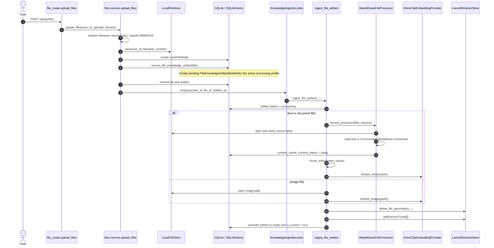

# File Upload, Embedding, and Caption Pipeline

This guide describes the implemented path from a user upload to searchable
knowledge. It is intentionally file-owned: a `UserFileModel` has derived
`FileKnowledgeArtifactModel` generations, while `KnowledgeBaseFileModel` only
references a file and never initiates duplicate work.

## Terminology

| Term | Meaning in Asterism | Implemented representation |
| --- | --- | --- |
| **Source file** | The immutable, user-owned upload from which knowledge is derived. It owns the original bytes and identity, not the derived text, vectors, or caption. | `UserFileModel` plus bytes in `LocalFileStore` |
| **Knowledge artifact** | The complete, versioned set of derived knowledge for one source-file revision under one processing profile: extraction result, chunk count, embedding readiness, canonical caption state, timestamps, and safe errors. This is the canonical meaning of *artifact* in this guide. | `FileKnowledgeArtifactModel` / `file_knowledge_artifacts` |
| **Artifact generation** | A monotonic version of a file's knowledge artifact. Reprocessing creates a new generation instead of modifying a usable one in place. | `FileKnowledgeArtifactModel.generation` and `VectorChunk.artifact_generation` |
| **Current artifact** | The one ready artifact generation selected for a source file. A replacement becomes current only after its vectors are written successfully. | `FileKnowledgeArtifactModel.is_current`, protected by a partial unique index |
| **Processing policy** | The single platform-wide extraction, chunking, embedding, and caption policy. Users cannot select a different model or policy per file or knowledge base. | Versioned `knowledge.processing` value in `ApplicationSettingsModel` |
| **Profile generation / identity** | The profile's revision number and deterministic fingerprint, copied into each artifact to show which policy produced it. A changed identity queues a replacement artifact for each eligible library file. | `processing_profile_generation`, `processing_profile_identity` |
| **Content cache** | Bounded converted text used as the input to chunking. It is source-file conversion state, distinct from the artifact's indexed vector rows. | `UserFileModel.content_cache`, produced by `MarkItDownFileProcessor` |
| **Chunk** | One bounded text excerpt, or the display content associated with a visual image embedding. A chunk has stable provenance within an artifact generation. | `VectorChunk` and a LanceDB `knowledge_chunks` row |
| **Embedding / vector** | A normalized numeric representation of a chunk, caption, or image used for similarity search. Vectors are not relational artifact fields; their provenance links them to an artifact generation. | `OnnxClipEmbeddingProvider`, `LanceDbVectorStore` |
| **Canonical caption** | The one derived caption associated with an image artifact, shared wherever that file is used. It may be generated, edited, cleared, or regenerated in Files; it is never per knowledge base. | Artifact caption fields and one caption `VectorChunk` |
| **Knowledge base** | A private, named collection used to curate which library files an agent may search. It does not own or duplicate a file's processing. | `KnowledgeBaseModel` |
| **Membership** | An ordered relationship between a knowledge base and a source file. Removing it preserves the file and its knowledge artifact. | `KnowledgeBaseFileModel` / `knowledge_base_files` |
| **Allowed file IDs** | The file IDs resolved from bases assigned to the active agent before a vector query is issued. This is the retrieval authorization boundary. | `AgentKnowledgeBaseAssignmentModel` plus `LanceDbVectorStore.search(..., allowed_file_ids=...)` |

## Components and ownership

| Concern | Primary classes / functions | Responsibility |
| --- | --- | --- |
| HTTP upload | `file_router.upload_files`, `files.service.upload_files` | Validates the request, writes source bytes, persists the source-file record, and queues work after commit. |
| Source bytes | `FileStore`, `LocalFileStore` | Owns bytes beneath `STORAGE_ROOT/files/{user_id}` and prevents path traversal. |
| File conversion | `MarkItDownFileProcessor.ensure_processed` | Produces bounded text cache for text/document files; verifies file integrity and records safe file-content errors. |
| Artifact state | `FileKnowledgeArtifactModel`, `ensure_file_knowledge_artifact` | Owns processing generation, profile fingerprint, status, extraction metadata, embeddings, and canonical caption fields. |
| Processing queue | `KnowledgeIngestionJobs`, `ingest_file_artifact` | Runs at most one in-process job per artifact ID and promotes a generation only after vector writes succeed. |
| Embeddings | `OnnxClipEmbeddingProvider` | Lazily verifies and loads the pinned local ONNX CLIP bundle, then emits normalized text or image vectors. |
| Vectors | `VectorChunk`, `LanceDbVectorStore` | Persists vectors keyed by user, file, artifact generation, and chunk ordinal. |
| Caption queue | `KnowledgeCaptionJobs`, `_caption_file_artifact` | Creates and indexes a canonical image caption after the image artifact is ready. |
| Caption providers | `LocalSmolVlm2CaptionProvider`, `_provider_caption_document` | Uses a verified local bundle or the single administrator-selected vision provider. |

`runtime.py` constructs the process-lifetime services: `vector_store`,
`embedding_provider`, `knowledge_ingestion_jobs`, `local_caption_provider`, and
`knowledge_caption_jobs`. `initialize_knowledge_runtime()` opens LanceDB and
makes interrupted jobs retryable; `shutdown_knowledge_runtime()` cancels jobs and
releases model and database resources.

## Upload to ready artifact



`upload_files()` creates the source record and the pending artifact in one
transaction. It starts the background work only after that commit, so a worker
never sees an uncommitted source file or artifact. Re-uploading intact bytes with
the same owner and sanitized name returns the existing file; different bytes use a
collision-suffixed name.

`ensure_file_knowledge_artifact()` resolves the typed, versioned
`knowledge.processing` application setting. Its profile generation and deterministic
identity are copied into the artifact. The artifact's unique `(file_id,
generation)` pair and partial unique current-generation index make the source
file—not a knowledge base—the unit of processing.

The setting is parsed by `KnowledgeProcessingConfiguration`, with nested
`KnowledgeProcessingCaptioningConfiguration`; the knowledge configuration
service (including `get_captioning_configuration()`,
`update_captioning_configuration()`, and
`update_processing_profile_and_reprocess()`) is the only domain path that
interprets or persists it. The legacy `KnowledgeCaptionConfigurationModel` and
`KnowledgeProcessingProfileModel` tables no longer exist. A missing or malformed
value resolves to the deterministic disabled-captioning default; the next typed
administrator update replaces a malformed value with a valid version-1 setting.

## Processing branches

For text and document files, `MarkItDownFileProcessor` checks the persisted
SHA-256, enforces `MAX_PROCESS_FILE_SIZE_BYTES`, runs conversion in a worker
thread with `FILE_CONVERSION_TIMEOUT_S`, and truncates output to
`MAX_CONVERTED_CHARS`. `chunk_text()` creates deterministic overlapping chunks
using `KNOWLEDGE_CHUNK_SIZE_CHARS` and `KNOWLEDGE_CHUNK_OVERLAP_CHARS`; it rejects
empty content and chunk counts above `MAX_KNOWLEDGE_CHUNKS_PER_DOCUMENT`.

For image files, the artifact does not need text conversion. `ingest_file_artifact()`
embeds the local file path as one visual vector and records the display string
`Image file: {original_name}` as its vector content. It also determines whether
captioning should be requested from the nested captioning configuration in
`knowledge.processing`.

`OnnxClipEmbeddingProvider` runs the configured, CPU-only `model.onnx` only after
verifying its SHA-256 and size. It uses local tokenizer/processor assets and
normalizes each 512-dimensional output. Its semaphore bounds embedding inference;
`LanceDbVectorStore` has a separate semaphore around blocking LanceDB operations.

Every `VectorChunk` carries the following provenance:

```text
id = SHA-256(file_id : artifact_generation : chunk_ordinal)
user_id, file_id, artifact_generation, chunk_ordinal, content, vector
```

Before adding vectors, the ingestion path deletes any partial rows for that exact
file generation. It writes replacement vectors before clearing the old artifact's
`is_current` flag. Consequently, a failed replacement can leave the previous
ready generation searchable but can never expose a partially indexed generation
as current.

## Caption generation

Caption work starts only after an image artifact reaches `ready` and the global
caption mode is not `disabled`.

```mermaid
sequenceDiagram
    autonumber
    participant Ingest as ingest_file_artifact
    participant DB as SQLite / SQLAlchemy
    participant Jobs as KnowledgeCaptionJobs
    participant Run as _caption_file_artifact
    participant Local as LocalSmolVlm2CaptionProvider
    participant Remote as LLMClient / selected vision provider
    participant Embed as OnnxClipEmbeddingProvider
    participant Vectors as LanceDbVectorStore

    Ingest->>DB: artifact.caption_status = pending
    Ingest->>Jobs: enqueue(user_id, file_id, artifact_id)
    Jobs->>DB: caption_status = running
    Jobs->>Run: runner(artifact, file)
    Run->>DB: get_captioning_configuration()
    alt mode = local
        Run->>Local: caption(CaptionRequest)
    else mode = provider
        Run->>Remote: generate(image data URL, concise-caption prompt)
    end
    Run-->>Jobs: CaptionResult(text, source, model)
    Jobs->>Embed: embed_text([caption])
    Jobs->>Vectors: delete_chunk(caption chunk ID)
    Jobs->>Vectors: add(caption VectorChunk)
    Jobs->>DB: caption_status = draft; persist text, source, model
```

`_caption_file_artifact()` verifies that the artifact is an image, the source
exists, and its bytes are within `MAX_VISION_IMAGE_BYTES`. It then uses exactly
one global configuration:

- `local`: `LocalSmolVlm2CaptionProvider` verifies the pinned manifest and every
  bundle-file hash before loading the CPU-only model. It does not download at
  inference time.
- `provider`: `_provider_caption_document()` loads the selected active,
  vision-capable provider model, creates an `LLMClient`, and sends the image as a
  data URL with a concise retrieval-caption prompt. This is the point at which an
  external provider receives image bytes.

Provider and model administration rejects removal or eligibility changes that
would orphan the selected caption provider. Administrators must first select
local or disabled captioning, which transitions `knowledge.processing` and
queues replacement generations before the provider or model can be removed.

`KnowledgeCaptionJobs` bounds concurrent captions, embeds a successful caption,
and stores it as `draft` canonical metadata. The caption vector uses the next
chunk ordinal (`artifact.chunk_count`) and a deterministic chunk ID based on the
file and artifact generation. Editing a caption through
`files.service.edit_file_caption()` replaces that vector and marks it `accepted`;
clearing it deletes the caption vector and marks it `cleared`.

## State, retry, and deletion rules

`FileKnowledgeArtifactStatus` moves from `pending` to `processing` to `ready`,
or to `failed`/`canceled`. `KnowledgeIngestionJobs.recover_interrupted()` changes
interrupted `processing` rows to retryable `pending` rows at startup; retry and
cancel API actions are implemented by `retry_file_knowledge_processing()` and
`cancel_file_knowledge_processing()`.

`KnowledgeCaptionStatus` is independent of artifact readiness: it can be
`pending`, `running`, `draft`, `accepted`, `cleared`, `failed`, or `canceled`.
Caption-job restart recovery changes only `running` captions to `failed` with an
`interrupted` error code. Safe error fields are persisted; source bytes and
caption text are not written to logs by the caption path.

Deleting a membership through `KnowledgeBaseFileModel` removes only the
collection reference. Deleting a source file calls
`files.service._remove_file_knowledge_records()` before removing the file row:
it cancels ingestion work, removes every membership and artifact, deletes vectors
best-effort after the database commit, and finally removes source bytes. A job
that resumes after deletion finds no matching file/artifact row and cannot restore
knowledge state.

## Retrieval boundary

The downstream [`search_knowledge`](../../apps/backend/asterism/domains/knowledge/search_tool.py)
tool first resolves `AgentKnowledgeBaseAssignmentModel` and
`KnowledgeBaseFileModel` rows to allowed file IDs. It then calls
`LanceDbVectorStore.search()` with both `user_id` and `allowed_file_ids`.
`LanceDbVectorStore` returns no results for an empty allowed set and has no
unfiltered search mode, preserving the authorization boundary at the vector-store
query rather than filtering global results in application code.

## Related guides

- [Knowledge retrieval and image captioning](knowledge-retrieval.md)
- [Data model and storage](data-and-storage.md)
- [LLM providers and model capabilities](llm-providers.md)
